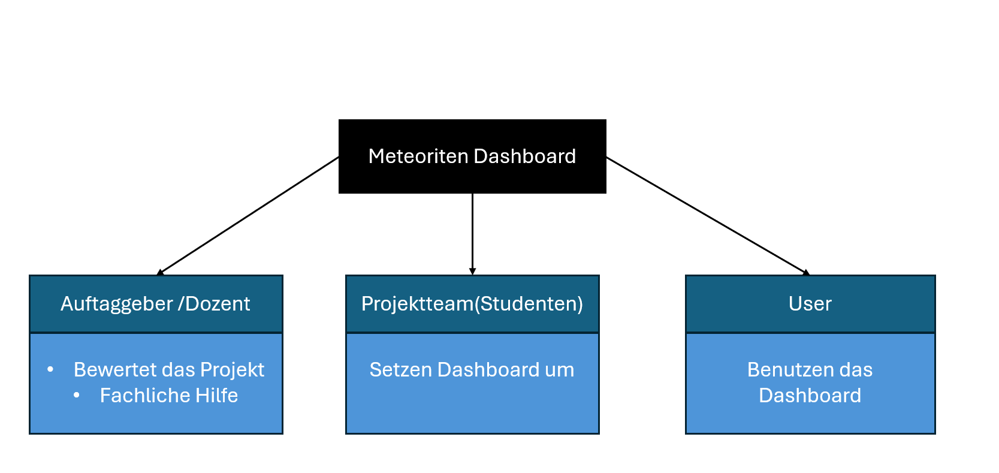

# Project Charta
## Context and Scope


Unser Projekt gehört zum geowissenschaftlichen Bereich und beschäftigt sich mit Meteoritenfunden. Ziel ist es, die weltweit bekannten Meteoriten interaktiv darzustellen und umfassend zu analysieren. Dabei werden insbesondere die geografische Verteilung, zeitliche Trends, Masse und Klassifikation der Meteoriten betrachtet. Das Projekt soll unter anderem folgende Fragen beantworten: Wo auf der Erde werden Meteoriten am häufigsten gefunden? Gibt es zeitliche oder regionale Muster bei der Masse oder Klassifikation der Meteoriten? Darüber hinaus können auf Basis dieser Daten weitere analytische Fragestellungen entwickelt werden, die gegebenenfalls mit zusätzlichen Datensätzen untersucht werden können.

Die Vorteile des Projekts liegen sowohl im wissenschaftlichen als auch im schulischen Bereich. Nutzer können die Daten interaktiv erkunden, Muster und Trends erkennen und Zusammenhänge anschaulich nachvollziehen. Das Visualisierungsprojekt ist besonders spannend für alle, die sich für Meteoriten interessieren. Man kann die Funde interaktiv entdecken, mehr über die geografische Verteilung, die Klassen und die Größen der Meteoriten erfahren und Zusammenhänge gut nachvollziehen. So wird das Ganze sowohl lehrreich als auch unterhaltsam, egal ob man einfach neugierig ist oder sich bereits tiefer für das Thema interessiert.

Das Projekt wird mit einer Shiny App umgesetzt und als Webseite zugänglich gemacht, sodass Interessierte direkt im Browser auf das Dashboard zugreifen können.


## Project Objectives and Success Criteria

### Projekziele
1. Die geografische Verteilung der Meteoritenfunde weltweit über Karten mit Latitude- und Longitude-Daten visualisieren können.  
2. Zeitliche Trends analysieren können, um Muster bei Meteoritenfällen oder Mteoritenfunden über die Jahre zu erkennen.  
3. Eigenschaften der Meteoriten wie Masse und Klassifikation einsehen und vergleichen können, beispielsweise zwischen Regionen oder Zeiträumen.  
4. Interaktiv mit den Daten arbeiten können, z.B. über Filter nach Jahr, Masse, Typ oder Region, um eigene Explorationen durchzuführen.

### Erfolgskriterien(qualitativ)
1. Nutzende können die Verteilung und Trends der Meteoriten intuitiv erkunden, ohne vorherige Schulung.
2. Regionale oder zeitliche Muster der Meteoritenfunde sind erkennbar.
3. Das Dashboard unterstützt interaktive Filterfunktionen und bietet klare visuelle Hinweise (Farbe, Größe).
4. Nutzerinnen und Nutzer können verschiedene Datenattribute (Masse, Klasse, Jahr) einfach vergleichen und analysieren.
5. Die Visualisierungen sind verständlich und selbsterklärend, sodass die Interpretation der Daten leicht fällt.

### Erfolgskriterien(qunatitativ) 
Keine Vorhanden 

### Out of scope
1. Das Dashboard zeigt nur bestehende, historische Meteoritenfunde, eine Echtzeitintegration neuer Funde wird nicht umgesetzt.
2. Es werden keine Vorhersagen erstellt, z. B. zur zukünftigen Fallstelle von Meteoriten oder zu Einschlagwahrscheinlichkeiten.


## Stakeholder Analysis
Im Projekt Meteoriten Dashboard sind drei zentrale Gruppen beteiligt: Der Auftraggeber (Dozent) bewertet das Projekt und bietet fachliche Unterstützung. Das Projektteam (Studenten) entwickelt und setzt das Dashboard um. Die User nutzen das fertige Dashboard aktiv. So sorgt das Team für eine Umsetzung nach den Vorgaben des Auftraggebers, während die User das Ergebnis direkt verwenden.

::: {.figure #fig:stakeholder}
{#fig:stakeholderfig}
Abbildung: Stakeholderanalyse
:::

## User Analysis
Analyse the target audience of the visualization product and create at least 2 personas with **relevant attributes** such as domain expertise, data literacy, technical environment (devices, screen sizes), frequency of use etc. Amend each persona with the dimensions of the customer profile side in the Value Proposition Canvas @Osterwalder2014:

* **User tasks** (jobs): What tasks are users trying to accomplish? Consider functional jobs (e.g. analysing data, making decisions), social jobs (e.g. reporting to stakeholders, collaborating with colleagues) and emotional jobs (e.g. feeling confident in their decisions).
* **Pains**: What obstacles, risks or undesired outcomes do users currently face? What makes their current approach frustrating or inefficient?
* **Gains**: What outcomes and benefits do users expect or desire? What would exceed their expectations?


## Situation Assessment
Für unsere Projektarbeit arbeiten wir mit einem Datensatz der NASA, der Daten von Meteoriteneinschlägen enthält. 
Unser Team besteht aus drei Personen. Als Software setzen wir hauptsächlich Python mit allen relevanten Zusatzpaketen ein, bei Bedarf kann weitere Software genutzt werden. Das Projekt soll bis zum 1. Juni abgeschlossen werden, wobei der Arbeitsaufwand auf die Teammitglieder verteilt und durch regelmässige Treffen koordiniert wird. Mögliche Risiken umfassen technische Probleme, Verzögerungen bei der Datenaufbereitung oder eine ungleichmässige Arbeitsverteilung im Team, welche den Zeitplan beeinflussen könnten.

## Visualization Concept
Translate the project objectives into a concrete visualization concept. This corresponds to the value map side of the Value Proposition Canvas [@Osterwalder2014] – describe how the proposed visualization product addresses the users' tasks, relieves their pains and creates gains. Address the following aspects:

* **Product form**: Composition of the visualization product – dashboard, data story, infographic, exploratory tool, etc.
* **Visual encodings**: Types of charts and visualizations to be used – e.g. bar chart, line chart, scatter plot, map, etc.
* **Interactivity**: Static vs. dynamic/interactive elements – filtering, drill-down, tooltips, linked views, etc.
* **Narrative and annotation**: Text elements, storytelling structure, annotations and contextual information.
* **Target medium and integration**: Embedding in the target environment – e.g. website, intranet, app, print, etc.

For each design decision, articulate the intended value along three dimensions:

* **Cognitive and analytical value**: How does the design amplify the user's ability to detect patterns, identify outliers, understand distributions or discover relationships [@card1999; @vanwijk2005]?
* **Communicative value**: How does the design support the communication of information to the target audience profile(s)? 
* **Experiential and aesthetic value**: How do the visual and interactive qualities of the design foster engagement, trust and willingness to adopt the product in practice?

Justify the concept by mapping it explicitly to the project objectives and the user needs identified in the user analysis.


## Project Plan
Divide the project into individual phases, describe them briefly and draw up a preliminary timetable, e.g. as a Gantt chart:

```{mermaid}
%%| label: fig-project-plan
%%| fig-cap: Preliminary project plan in the form of a Gantt chart.
gantt
    title Project Plan
    dateFormat YYYY-MM-DD
    tickInterval 5day
    section Project Understanding
        Initiation workshop and context analysis     :a1, 2024-07-01, 1d
        Stakeholder and user analysis     :a3, 2024-07-02, 5d
        Situation assessment    :a4, 2024-07-06, 1d
        Project objectives and visualization concept    :a5, 2024-07-07, 1d
        Sign project charta: milestone, m1, 2024-07-08, 1d
    
    section Data Acquisition and Exploration
        Acquire data :a6, 2024-07-08, 3d
        Exploratory data analysis   :a7, 2024-07-09, 2d
        Discuss data report: milestone, m2, 2024-07-11, 1d
        
    section Visual Encoding and Design
        Overview charts   :a8, 2024-07-11, 3d
        Maps :a9, 2024-07-11, 5d
        Implement Dashboard prototype :a10, 2024-07-16, 5d
        Complete visualization report :a10, 2024-07-21, 1d
    section Evaluation
        Prepare presentation :a10, 2024-07-22, 2d
        Project presentation : milestone, m2, 2024-07-24, 4m
```

See [Mermaid syntax for Gantt charts](https://mermaid.js.org/syntax/gantt.html). It might not be displayed correctly in Safari &#8594; use Chrome. [Live editor with export functionality](https://mermaid.live/)

## Roles and Contact Details
List the people involved in the development work here with their role titles, tasks and contact details.